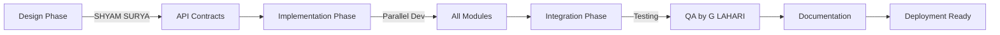

# ai-finder-tool-group-2
<div align="center">

# 🤖 AI Tool Finder - Curated Tools Platform


### *A comprehensive backend system for discovering, filtering, and reviewing AI tools with admin moderation*

[Features](#-features) • [Setup](#-setup-instructions) • [API Docs](#-api-documentation) • [Team](#-team-contributions) • [Testing](#-testing)

</div>

---

## 📋 Table of Contents

<details open>
<summary>Click to expand</summary>

- [🎯 Project Overview](#-project-overview)
- [✨ Features](#-features)
- [🛠 Technologies Used](#-technologies-used)
- [👥 Team Contributions](#-team-contributions)
- [🏗 System Architecture](#-system-architecture)
- [💾 Database Schema](#-database-schema)
- [🚀 Setup Instructions](#-setup-instructions)
- [📚 API Documentation](#-api-documentation)
- [🧪 Testing](#-testing)
- [📁 Project Structure](#-project-structure)
- [🎯 Key Implementation Details](#-key-implementation-details)
- [🐛 Known Issues & Future Enhancements](#-known-issues--future-enhancements)

</details>

---

## 🎯 Project Overview

<div align="center">


</div>

**AI Tool Finder** is a robust backend platform designed to help users discover and evaluate AI tools through a curated, moderation-based system. The platform focuses on:

<table>
<tr>
<td width="25%" align="center">
<br/>
<b>Data Management</b><br/>
Structured storage of AI tools and reviews
</td>
<td width="25%" align="center">
<br/>
<b>Advanced Filtering</b><br/>
Multi-parameter filtering system
</td>
<td width="25%" align="center">
<br/>
<b>Rating Computation</b><br/>
Automatic average calculation
</td>
<td width="25%" align="center">
<br/>
<b>Admin Moderation</b><br/>
Complete review control
</td>
</tr>
</table>

---

## ✨ Features

<details open>
<summary><b>Core Features</b></summary>

| Feature | Description | Status |
|---------|-------------|--------|
| 🛠️ **AI Tool Management** | CRUD operations with categories and pricing | ✅ Complete |
| 🔍 **Advanced Filtering** | Filter by category, rating, and pricing | ✅ Complete |
| ⭐ **Review System** | User submissions with ratings | ✅ Complete |
| 📊 **Rating Computation** | Auto-calculation from approved reviews | ✅ Complete |
| 👮 **Admin Moderation** | Review approval workflow | ✅ Complete |
| 🔐 **JWT Authentication** | Secure token-based auth | ✅ Complete |
| 📋 **Status Management** | PENDING → APPROVED/REJECTED | ✅ Complete |

</details>

<details>
<summary><b>Security Features</b></summary>

- 🔒 JWT-based authentication
- 🔒 Role-based access control (Admin vs User)
- 🔒 BCrypt password encryption
- 🔒 Stateless session management
- 🔒 Admin ownership validation
- 🔒 Protected admin endpoints

</details>

---

## 🛠 Technologies Used

<div align="center">

### Backend Framework


### Security & Authentication


### Database


### Build Tool


</div>

---

## 👥 Team Contributions

<div align="center">

### 🎨 Meet Our Amazing Team

</div>

<table>
<tr>
<td width="20%" align="center">
<br/>
<b>SHYAM SURYA</b><br/>
<sub>API Design & Architecture</sub><br/>

</td>
<td width="80%">
<h4>🎨 API Design & Architecture Lead</h4>
<ul>
<li>✅ Designed complete RESTful API architecture</li>
<li>✅ Established endpoint structures and naming conventions</li>
<li>✅ Created security configuration and filter chain</li>
<li>✅ Designed authentication flow (register/login)</li>
<li>✅ Structured controller layer organization</li>
</ul>
<b>Key Files:</b> <code>SecurityConfig.java</code>, <code>AdminController.java</code>, <code>JWTAuthenticationFilter.java</code>
</td>
</tr>

<tr>
<td width="20%" align="center">
<br/>
<b>AMARJITH M</b><br/>
<sub>Filtering Logic</sub><br/>

</td>
<td width="80%">
<h4>🔍 Filtering System Developer</h4>
<ul>
<li>✅ Implemented multi-parameter filtering system</li>
<li>✅ Developed dynamic JPQL queries with optional parameters</li>
<li>✅ Created case-insensitive filtering logic</li>
<li>✅ Added rating threshold filtering (≥ comparison)</li>
<li>✅ Optimized query performance</li>
</ul>
<b>Key Files:</b> <code>AiToolsRepo.java</code>, <code>AiToolsServices.java</code>, <code>UserController.java</code><br/>
<b>Endpoints:</b> <code>GET /user/tools?category=NLP&rating=4.0&price=Free</code>
</td>
</tr>

<tr>
<td width="20%" align="center">
<br/>
<b>DEBANSHA SETHI</b><br/>
<sub>Rating Computation</sub><br/>

</td>
<td width="80%">
<h4>⭐ Rating Algorithm Developer</h4>
<ul>
<li>✅ Designed automatic rating computation algorithm</li>
<li>✅ Implemented averaging logic with stream operations</li>
<li>✅ Created precision rounding (1 decimal place)</li>
<li>✅ Handled edge cases (empty reviews → 0.0 rating)</li>
<li>✅ Integrated with review approval workflow</li>
<li>✅ Ensured only APPROVED reviews affect ratings</li>
</ul>
<b>Key Files:</b> <code>AiToolsServices.java</code>, <code>ReviewController.java</code>, <code>ReviewRepo.java</code><br/>
<b>Algorithm:</b> Average = Σ(approved ratings) / count → Round to 1 decimal
</td>
</tr>

<tr>
<td width="20%" align="center">
<br/>
<b>KRISHNADEV M</b><br/>
<sub>Admin Moderation</sub><br/>

</td>
<td width="80%">
<h4>🛡️ Admin Moderation System Developer</h4>
<ul>
<li>✅ Implemented complete admin moderation workflow</li>
<li>✅ Developed review approval/rejection system</li>
<li>✅ Created admin ownership validation</li>
<li>✅ Built endpoints for pending reviews</li>
<li>✅ Implemented AI tool CRUD operations</li>
<li>✅ Added duplicate approval prevention</li>
</ul>
<b>Key Files:</b> <code>ReviewController.java</code>, <code>AiToolsController.java</code><br/>
<b>Endpoints:</b> <code>PUT /admin/reviews/approve/{id}</code>, <code>GET /admin/reviews/pending/{id}</code>
</td>
</tr>

<tr>
<td width="20%" align="center">
<br/>
<b>G LAHARI</b><br/>
<sub>Testing & Documentation</sub><br/>

</td>
<td width="80%">
<h4>📝 Quality Assurance & Documentation Specialist</h4>
<ul>
<li>✅ Comprehensive API testing across all endpoints</li>
<li>✅ Created detailed API documentation</li>
<li>✅ Prepared Postman collection</li>
<li>✅ Conducted integration testing</li>
<li>✅ Documented edge cases and error scenarios</li>
<li>✅ Created setup and deployment instructions</li>
<li>✅ Prepared submission documentation</li>
</ul>
<b>Deliverables:</b> API docs, test cases, screenshots, demo video, README
</td>
</tr>
</table>

---

## 🏗 System Architecture

<details>
<summary><b>Click to view architecture diagram</b></summary>
```
┌─────────────────────────────────────────────────────────────┐
│                     CLIENT REQUESTS                          │
│                  (Postman / Frontend)                        │
└─────────────────────────────────────────────────────────────┘
                            │
                            ▼
┌─────────────────────────────────────────────────────────────┐
│              JWT AUTHENTICATION FILTER                       │
│         JWTAuthenticationFilter validates tokens             │
│              Extracts username from JWT                      │
└─────────────────────────────────────────────────────────────┘
                            │
                            ▼
┌─────────────────────────────────────────────────────────────┐
│                   SECURITY CONFIG                            │
│  ┌────────────────────────────────────────────────────┐    │
│  │  Route Security:                                    │    │
│  │  • /auth/**        → ✅ Public (permitAll)         │    │
│  │  • /user/**        → ✅ Public (permitAll)         │    │
│  │  • /admin/**       → 🔒 Authenticated Required     │    │
│  │  • SessionPolicy   → STATELESS                     │    │
│  └────────────────────────────────────────────────────┘    │
└─────────────────────────────────────────────────────────────┘
                            │
                            ▼
┌─────────────────────────────────────────────────────────────┐
│                   CONTROLLER LAYER                           │
│  ┌──────────────┐  ┌──────────────┐  ┌──────────────┐     │
│  │   Admin      │  │    Review    │  │   AiTools    │     │
│  │  Controller  │  │  Controller  │  │  Controller  │     │
│  │  • Register  │  │  • Approve   │  │  • Add Tool  │     │
│  │  • Login     │  │  • Pending   │  │  • Get All   │     │
│  └──────────────┘  └──────────────┘  └──────────────┘     │
│  ┌──────────────┐                                           │
│  │    User      │                                           │
│  │  Controller  │                                           │
│  │  • Filter    │                                           │
│  │  • Review    │                                           │
│  └──────────────┘                                           │
└─────────────────────────────────────────────────────────────┘
                            │
                            ▼
┌─────────────────────────────────────────────────────────────┐
│                    SERVICE LAYER                             │
│  ┌──────────────────────────────────────────────────┐      │
│  │  AiToolsServices                                  │      │
│  │  • updateAiToolRating() - Rating Algorithm        │      │
│  │  • getFilteredTools() - Filtering Logic           │      │
│  └──────────────────────────────────────────────────┘      │
│  ┌──────────────────────────────────────────────────┐      │
│  │  JWTService                                       │      │
│  │  • generateToken() - Token Creation               │      │
│  │  • validateToken() - Token Verification           │      │
│  └──────────────────────────────────────────────────┘      │
│  ┌──────────────────────────────────────────────────┐      │
│  │  CustomUserDetailsService                         │      │
│  │  • loadUserByUsername() - User Loading            │      │
│  └──────────────────────────────────────────────────┘      │
└─────────────────────────────────────────────────────────────┘
                            │
                            ▼
┌─────────────────────────────────────────────────────────────┐
│                  REPOSITORY LAYER (JPA)                      │
│  ┌────────────┐  ┌────────────┐  ┌────────────┐           │
│  │  AdminRepo │  │ ReviewRepo │  │AiToolsRepo │           │
│  │  • findBy  │  │ • Approved │  │ • Filter   │           │
│  │    Name    │  │ • Pending  │  │   Query    │           │
│  └────────────┘  └────────────┘  └────────────┘           │
└─────────────────────────────────────────────────────────────┘
                            │
                            ▼
┌─────────────────────────────────────────────────────────────┐
│                      DATABASE (MySQL)                        │
│  ┌─────────────────────────────────────────────────┐       │
│  │  Tables:                                         │       │
│  │  • admins       (id, name, password)            │       │
│  │  • ai_tools     (id, name, category, rating...) │       │
│  │  • reviews      (id, content, rating, status)   │       │
│  └─────────────────────────────────────────────────┘       │
└─────────────────────────────────────────────────────────────┘
```

</details>

---

## 💾 Database Schema

<details>
<summary><b>Click to view database structure</b></summary>

### Entity Relationship Diagram
```
┌─────────────────┐         ┌─────────────────┐         ┌─────────────────┐
│     ADMINS      │         │    AI_TOOLS     │         │    REVIEWS      │
├─────────────────┤         ├─────────────────┤         ├─────────────────┤
│ id (PK)         │────┐    │ id (PK)         │────┐    │ id (PK)         │
│ name (UNIQUE)   │    │    │ name            │    │    │ content         │
│ password        │    │    │ description     │    │    │ rating          │
└─────────────────┘    │    │ usecases        │    │    │ status          │
                       │    │ category        │    │    │ ai_tool_id (FK) │
                       │    │ pricingtype     │    │    └─────────────────┘
                       │    │ rating          │    │              ▲
                       │    │ admin_id (FK)   │    │              │
                       │    └─────────────────┘    │              │
                       │              ▲             │              │
                       │              │             │              │
                       └──────────────┘             └──────────────┘
                        One-to-Many                   One-to-Many
```

### Table Definitions

#### 1️⃣ **admins** Table
```sql
CREATE TABLE admins (
    id BIGINT PRIMARY KEY AUTO_INCREMENT,
    name VARCHAR(255) NOT NULL UNIQUE,
    password VARCHAR(255) NOT NULL
);
```

#### 2️⃣ **ai_tools** Table
```sql
CREATE TABLE ai_tools (
    id BIGINT PRIMARY KEY AUTO_INCREMENT,
    name VARCHAR(255) NOT NULL,
    description TEXT,
    usecases TEXT,
    category VARCHAR(100),
    pricingtype VARCHAR(50),
    rating DOUBLE DEFAULT 0.0,
    admin_id BIGINT,
    FOREIGN KEY (admin_id) REFERENCES admins(id)
);
```

#### 3️⃣ **reviews** Table
```sql
CREATE TABLE reviews (
    id BIGINT PRIMARY KEY AUTO_INCREMENT,
    content TEXT NOT NULL,
    rating DOUBLE NOT NULL,
    status VARCHAR(20) NOT NULL DEFAULT 'PENDING',
    ai_tool_id BIGINT,
    FOREIGN KEY (ai_tool_id) REFERENCES ai_tools(id),
    CHECK (status IN ('PENDING', 'APPROVED', 'REJECTED'))
);
```

### Relationships

| Relationship | Type | Description |
|--------------|------|-------------|
| Admin → AiTool | One-to-Many | One admin can create multiple AI tools |
| AiTool → Review | One-to-Many | One AI tool can have multiple reviews |
| Admin → Review | Indirect | Admin moderates reviews for their tools |

</details>

---

## 🚀 Setup Instructions

<details open>
<summary><b>Click to view setup steps</b></summary>

### Prerequisites

<table>
<tr>
<td align="center" width="25%">
<br/>
<b>Java 17+</b>
</td>
<td align="center" width="25%">
<br/>
<b>Maven 3.6+</b>
</td>
<td align="center" width="25%">
<br/>
<b>MySQL 8.0+</b>
</td>
<td align="center" width="25%">
<br/>
<b>Postman</b>
</td>
</tr>
</table>

### Step-by-Step Installation

#### 1️⃣ Clone the Repository
```bash
git clone <repository-url>
cd AIToolsLearn
```

#### 2️⃣ Configure Database
Edit `src/main/resources/application.properties`:
```properties
# Database Configuration
spring.datasource.url=jdbc:mysql://localhost:3306/ai_tools_db
spring.datasource.username=your_username
spring.datasource.password=your_password

# JPA Configuration
spring.jpa.hibernate.ddl-auto=update
spring.jpa.show-sql=true
spring.jpa.properties.hibernate.dialect=org.hibernate.dialect.MySQLDialect

# Server Configuration
server.port=8080
```

#### 3️⃣ Create Database
```sql
CREATE DATABASE ai_tools_db;
```

#### 4️⃣ Build the Project
```bash
mvn clean install
```

#### 5️⃣ Run the Application
```bash
mvn spring-boot:run
```

Or:
```bash
java -jar target/AIToolsLearn-0.0.1-SNAPSHOT.jar
```

#### 6️⃣ Verify Installation
```bash
curl http://localhost:8080/user/getAll
```

<div align="center">
<b>✅ Application running at:</b> <code>http://localhost:8080</code>
</div>

</details>

---

## 📚 API Documentation

<div align="center">

### 🌐 Base URL: `http://localhost:8080`

</div>

### 🔐 Authentication Endpoints

<details>
<summary><b>1. Register Admin</b> - <code>POST /auth/admin/register</code></summary>

**Request:**
```json
{
    "name": "admin1",
    "password": "admin123"
}
```

**Success Response (200):**
```json
{
    "status": "created user"
}
```

**Error Response (400):**
```json
{
    "Error": "UserName already Exists"
}
```

</details>

<details>
<summary><b>2. Login Admin</b> - <code>POST /auth/admin/login</code></summary>

**Request:**
```json
{
    "name": "admin1",
    "password": "admin123"
}
```

**Success Response (200):**
```json
{
    "token": "eyJhbGciOiJIUzI1NiIsInR5cCI6IkpXVCJ9...",
    "message": "Login successful",
    "username": "admin1"
}
```

**Usage:**
```
Authorization: Bearer <token>
```

</details>

---

### 🤖 AI Tools Endpoints

<details>
<summary><b>3. Get All AI Tools (Admin)</b> - <code>GET /admin/aitools</code></summary>

**Headers:**
```
Authorization: Bearer <admin-token>
```

**Response (200):**
```json
[
    {
        "id": 1,
        "name": "ChatGPT",
        "description": "AI-powered conversational assistant",
        "usecases": "Text generation, Q&A, Coding help",
        "category": "NLP",
        "pricingtype": "Subscription",
        "rating": 4.5
    }
]
```

</details>

<details>
<summary><b>4. Add AI Tool</b> - <code>POST /admin/aitools/add</code> 🔒</summary>

**Headers:**
```
Authorization: Bearer <admin-token>
```

**Request:**
```json
{
    "name": "GitHub Copilot",
    "description": "AI pair programmer",
    "usecases": "Code completion, Bug fixes, Test generation",
    "category": "Dev Tools",
    "pricingtype": "Subscription"
}
```

**Response (200):**
```json
{
    "id": 3,
    "name": "GitHub Copilot",
    "description": "AI pair programmer",
    "usecases": "Code completion, Bug fixes, Test generation",
    "category": "Dev Tools",
    "pricingtype": "Subscription",
    "rating": 0.0
}
```

</details>

<details>
<summary><b>5. Filter AI Tools</b> - <code>GET /user/tools</code></summary>

**Query Parameters:**
- `category` - Filter by category (e.g., "NLP", "Computer Vision")
- `price` - Filter by pricing (e.g., "Free", "Paid", "Subscription")
- `rating` - Minimum rating threshold (e.g., 4.0)

**Examples:**
```bash
# Single filter
GET /user/tools?category=NLP

# Multiple filters
GET /user/tools?category=NLP&rating=4.0&price=Free

# Rating only
GET /user/tools?rating=4.5
```

**Response (200):**
```json
[
    {
        "id": 1,
        "name": "ChatGPT",
        "category": "NLP",
        "pricingtype": "Free",
        "rating": 4.5
    }
]
```

</details>

---

### ⭐ Review Endpoints

<details>
<summary><b>6. Submit Review</b> - <code>POST /user/user/reviews/add/{toolId}</code></summary>

**Request:**
```json
{
    "content": "Amazing tool! Very helpful for coding.",
    "rating": 4.5
}
```

**Response (200):**
```json
{
    "status": "Review submitted successfully. It will be visible after admin approval."
}
```

**Note:** ⏳ Status set to PENDING by default

</details>

<details>
<summary><b>7. Get Approved Reviews</b> - <code>GET /user/user/reviews/approved/{toolId}</code></summary>

**Response (200):**
```json
[
    {
        "id": 1,
        "content": "Amazing tool! Very helpful for coding.",
        "rating": 4.5,
        "status": "APPROVED"
    }
]
```

</details>

<details>
<summary><b>8. Get Pending Reviews (Admin)</b> - <code>GET /admin/reviews/pending/{toolId}</code> 🔒</summary>

**Headers:**
```
Authorization: Bearer <admin-token>
```

**Response (200):**
```json
[
    {
        "id": 3,
        "content": "Could be better",
        "rating": 3.0,
        "status": "PENDING"
    }
]
```

</details>

<details>
<summary><b>9. Approve Review</b> - <code>PUT /admin/reviews/approve/{reviewId}</code> 🔒</summary>

**Headers:**
```
Authorization: Bearer <admin-token>
```

**Response (200):**
```json
{
    "status": "Review approved successfully and AI tool rating updated"
}
```

**Side Effect:** ⚡ Automatically triggers rating recalculation

**Error Responses:**
- 404: Review not found
- 400: Review already approved
- 403: Admin doesn't own this AI tool

</details>

<details>
<summary><b>10. Recalculate Rating (Admin)</b> - <code>PUT /admin/aitools/{toolId}/recalculate-rating</code> 🔒</summary>

**Headers:**
```
Authorization: Bearer <admin-token>
```

**Response (200):**
```json
{
    "status": "AI tool rating recalculated successfully"
}
```

**Use Case:** Manual recalculation if needed

</details>

---

## 🧪 Testing

<details>
<summary><b>Complete User Journey Test</b></summary>

### Test Workflow
```bash
# Step 1: Register Admin
POST /auth/admin/register
Body: {"name": "admin1", "password": "admin123"}

# Step 2: Login Admin
POST /auth/admin/login
Body: {"name": "admin1", "password": "admin123"}
# 📋 Copy the token from response

# Step 3: Add AI Tool
POST /admin/aitools/add
Headers: Authorization: Bearer <token>
Body: {
    "name": "ChatGPT",
    "description": "AI assistant",
    "usecases": "Text generation",
    "category": "NLP",
    "pricingtype": "Free"
}
# 📋 Note the tool ID

# Step 4: Submit Reviews (as user)
POST /user/user/reviews/add/1
Body: {"content": "Great tool!", "rating": 5.0}

POST /user/user/reviews/add/1
Body: {"content": "Very useful", "rating": 4.5}

# Step 5: View Pending Reviews
GET /admin/reviews/pending/1
Headers: Authorization: Bearer <token>

# Step 6: Approve Reviews
PUT /admin/reviews/approve/1
Headers: Authorization: Bearer <token>

PUT /admin/reviews/approve/2
Headers: Authorization: Bearer <token>

# Step 7: Verify Rating Updated
GET /user/getAll
# ✅ Tool rating should be 4.8 (average of 5.0 and 4.5, rounded to 4.8)

# Step 8: Test Filtering
GET /user/tools?category=NLP&rating=4.0
GET /user/tools?price=Free
```

</details>

<details>
<summary><b>Rating Computation Test Cases</b></summary>

| Scenario | Reviews | Expected Rating | Pass ✅ |
|----------|---------|-----------------|---------|
| No reviews | [] | 0.0 | ✅ |
| Single review | [5.0] | 5.0 | ✅ |
| Two reviews | [4.5, 3.7] | 4.1 | ✅ |
| Three reviews | [5.0, 4.0, 3.5] | 4.2 | ✅ |
| Rounding down | [4.449, 4.449] | 4.4 | ✅ |
| Rounding up | [4.450, 4.450] | 4.5 | ✅ |
| Perfect score | [5.0, 5.0, 5.0] | 5.0 | ✅ |

</details>

<details>
<summary><b>Filtering Test Cases</b></summary>

| Test Case | URL | Expected Result |
|-----------|-----|-----------------|
| Category filter | `/user/tools?category=NLP` | All NLP tools |
| Rating filter | `/user/tools?rating=4.0` | Tools with rating ≥ 4.0 |
| Price filter | `/user/tools?price=Free` | All free tools |
| Combined filters | `/user/tools?category=NLP&rating=4.5&price=Free` | Free NLP tools rated ≥ 4.5 |
| Case insensitive | `/user/tools?category=nlp` | Same as NLP (case insensitive) |

</details>

---

## 📁 Project Structure

<details>
<summary><b>Click to view complete file structure</b></summary>
```
AIToolsLearn/
│
├── src/
│   ├── main/
│   │   ├── java/com/example/AIToolsLearn/
│   │   │   │
│   │   │   ├── config/
│   │   │   │   └── SecurityConfig.java          # 🎨 SHYAM SURYA
│   │   │   │
│   │   │   ├── controller/
│   │   │   │   ├── AdminController.java         # 🎨 SHYAM SURYA
│   │   │   │   ├── AiToolsController.java       # 🛡️ KRISHNADEV M
│   │   │   │   ├── ReviewController.java        # 🛡️ KRISHNADEV M
│   │   │   │   └── UserController.java          # 🔍 AMARJITH M
│   │   │   │
│   │   │   ├── filter/
│   │   │   │   └── JWTAuthenticationFilter.java # 🎨 SHYAM SURYA
│   │   │   │
│   │   │   ├── model/
│   │   │   │   ├── Admin.java                   # Entity
│   │   │   │   ├── AiTool.java                  # Entity
│   │   │   │   └── Review.java                  # Entity
│   │   │   │
│   │   │   ├── repository/
│   │   │   │   ├── AdminRepo.java               # Data Access
│   │   │   │   ├── AiToolsRepo.java             # 🔍 AMARJITH M
│   │   │   │   └── ReviewRepo.java              # ⭐ DEBANSHA SETHI
│   │   │   │
│   │   │   ├── services/
│   │   │   │   ├── AiToolsServices.java         # ⭐ DEBANSHA SETHI
│   │   │   │   ├── CustomUserDetailsService.java
│   │   │   │   ├── JWTService.java              # Auth Service
│   │   │   │   └── ReveiwService.java
│   │   │   │
│   │   │   ├── userdetails/
│   │   │   │   └── CustomUserDetails.java
│   │   │   │
│   │   │   └── AIToolsLearnApplication.java     # Main
│   │   │
│   │   └── resources/
│   │       └── application.properties            # Config
│   │
│   └── test/
│       └── java/                                 # 📝 G LAHARI
│
├── pom.xml                                        # Dependencies
├── README.md                                      # This file
└── Documentation/                                 # 📝 G LAHARI
    ├── API_Examples.pdf
    ├── Screenshots/
    └── Demo_Video.mp4
```

</details>

---

## 🎯 Key Implementation Details

<details>
<summary><b>1. Rating Computation Algorithm</b> - ⭐ DEBANSHA SETHI</summary>
```java
public void updateAiToolRating(Long aiToolId) {
    // Step 1: Fetch AI tool
    AiTool aiTool = aiToolsRepo.findById(aiToolId)
            .orElseThrow(() -> new RuntimeException("AI Tool not found"));

    // Step 2: Get approved reviews only
    List<Review> approvedReviews = reviewRepo.findApprovedReviewsByAiToolId(aiToolId);

    // Step 3: Handle edge case
    if (approvedReviews.isEmpty()) {
        aiTool.setRating(0.0);  // No reviews = 0.0 rating
    } else {
        // Step 4: Calculate average using Java Streams
        double averageRating = approvedReviews.stream()
                .mapToDouble(Review::getRating)
                .average()
                .orElse(0.0);
        
        // Step 5: Round to 1 decimal place
        // Example: 4.567 → 4.6, 4.449 → 4.4
        averageRating = Math.round(averageRating * 10.0) / 10.0;
        
        aiTool.setRating(averageRating);
    }
    
    // Step 6: Persist changes to database
    aiToolsRepo.save(aiTool);
}
```

**Algorithm Explanation:**
- ✅ Only APPROVED reviews count
- ✅ Stream API for efficient averaging
- ✅ Precision: 1 decimal place
- ✅ Edge case: Empty reviews → 0.0
- ✅ Real-time updates on approval

</details>

<details>
<summary><b>2. Dynamic Filtering Query</b> - 🔍 AMARJITH M</summary>
```java
@Query("""
    SELECT t FROM AiTool t
    WHERE (:category IS NULL OR LOWER(t.category) = LOWER(:category))
      AND (:pricingtype IS NULL OR LOWER(t.pricingtype) = LOWER(:pricingtype))
      AND (:rating IS NULL OR t.rating >= :rating)
""")
List<AiTool> filterTools(
    @Param("category") String category,
    @Param("pricingtype") String pricingtype,
    @Param("rating") Double rating
);
```

**Query Features:**
- ✅ Optional parameters (NULL-safe)
- ✅ Case-insensitive matching
- ✅ Rating threshold (≥ comparison)
- ✅ Combine multiple filters
- ✅ JPQL for database independence

**Example Usage:**
```java
// All parameters
getFilteredTools("NLP", 4.5, "Free");

// Only category
getFilteredTools("NLP", null, null);

// Category + Rating
getFilteredTools("Dev Tools", 4.0, null);
```

</details>

<details>
<summary><b>3. JWT Authentication Flow</b> - 🎨 SHYAM SURYA</summary>
```java
// Token Generation (Login)
@PostMapping("/login")
public ResponseEntity<?> login(@RequestBody Admin admin) {
    // Authenticate user
    Authentication auth = authenticationManager.authenticate(
        new UsernamePasswordAuthenticationToken(
            admin.getName(), 
            admin.getPassword()
        )
    );
    
    // Generate JWT token
    UserDetails userDetails = customUserDetailsService
        .loadUserByUsername(admin.getName());
    String token = jwtService.generateToken(userDetails);
    
    return ResponseEntity.ok(Map.of("token", token));
}

// Token Validation (Filter)
@Override
protected void doFilterInternal(HttpServletRequest request, 
                                HttpServletResponse response, 
                                FilterChain filterChain) {
    String authHeader = request.getHeader("Authorization");
    
    if (authHeader != null && authHeader.startsWith("Bearer ")) {
        String jwt = authHeader.substring(7);
        String username = jwtService.extractUsername(jwt);
        
        if (jwtService.isTokenValid(jwt, userDetails)) {
            // Set authentication in security context
            SecurityContextHolder.getContext()
                .setAuthentication(authToken);
        }
    }
    
    filterChain.doFilter(request, response);
}
```

**Security Flow:**
1. User logs in → Credentials validated
2. JWT token generated with username
3. Token returned to client
4. Client includes token in headers
5. Filter validates token on each request
6. Authentication set in security context

</details>

<details>
<summary><b>4. Admin Ownership Validation</b> - 🛡️ KRISHNADEV M</summary>
```java
@PutMapping("/admin/reviews/approve/{id}")
public ResponseEntity<?> approveReview(@PathVariable Long id, 
                                      Authentication authentication) {
    // Step 1: Fetch review
    Review review = reviewRepo.findById(id)
        .orElseThrow(() -> new RuntimeException("Review not found"));
    
    // Step 2: Prevent duplicate approvals
    if (review.getStatus() == Review.ReviewStatus.APPROVED) {
        throw new RuntimeException("Review is already approved");
    }
    
    // Step 3: Get authenticated admin
    CustomUserDetails userDetails = 
        (CustomUserDetails) authentication.getPrincipal();
    Admin authenticatedAdmin = 
        adminRepo.findByName(userDetails.getUsername());
    
    // Step 4: Get tool owner
    Admin aiToolAdmin = review.getAiTool().getAdmin();
    
    // Step 5: Validate ownership
    if (!authenticatedAdmin.getId().equals(aiToolAdmin.getId())) {
        throw new RuntimeException(
            "You are not authorized to approve this review"
        );
    }
    
    // Step 6: Approve and update rating
    review.setStatus(Review.ReviewStatus.APPROVED);
    reviewRepo.save(review);
    
    aiToolsServices.updateAiToolRating(review.getAiTool().getId());
    
    return ResponseEntity.ok(Map.of(
        "status", "Review approved and rating updated"
    ));
}
```

**Security Checks:**
- ✅ Review exists validation
- ✅ Already approved check
- ✅ Admin authentication
- ✅ Ownership verification
- ✅ Automatic rating update

</details>

---

## 🐛 Known Issues & Future Enhancements

<details>
<summary><b>Current Limitations</b></summary>

| Issue | Impact | Priority |
|-------|--------|----------|
| No user authentication for reviews | Anyone can submit reviews | 🔴 High |
| No pagination | Large datasets cause performance issues | 🟡 Medium |
| Basic error handling | Returns 500 for most errors | 🟡 Medium |
| No rate limiting | Vulnerable to spam/DDoS | 🔴 High |
| No review edit/delete | Can't modify submitted reviews | 🟢 Low |
| Single admin role | No granular permissions | 🟡 Medium |

</details>

<details>
<summary><b>Planned Enhancements</b></summary>

### Phase 1: Security & Performance
- [ ] Add user authentication system
- [ ] Implement API rate limiting
- [ ] Add pagination and sorting
- [ ] Improve exception handling with proper HTTP codes

### Phase 2: Features
- [ ] Review edit and delete endpoints
- [ ] Add analytics dashboard
- [ ] Email notifications for approvals
- [ ] Implement role-based permissions

### Phase 3: Optimization
- [ ] Add caching layer (Redis)
- [ ] Implement soft delete
- [ ] Database query optimization
- [ ] Add monitoring and logging

</details>

---

## 📊 Performance Metrics

<details>
<summary><b>Database Query Analysis</b></summary>

| Operation | Queries | Optimized | Notes |
|-----------|---------|-----------|-------|
| Get All Tools | 1 | ✅ | Single SELECT |
| Filter Tools | 1 | ✅ | Dynamic WHERE clause |
| Submit Review | 2 | ✅ | INSERT + SELECT |
| Approve Review | 3-4 | ⚠️ | Can be optimized |
| Recalculate Rating | 3 | ⚠️ | Batch updates possible |

### Recommended Indexes
```sql
-- Improve filtering performance
CREATE INDEX idx_category ON ai_tools(category);
CREATE INDEX idx_rating ON ai_tools(rating);
CREATE INDEX idx_pricingtype ON ai_tools(pricingtype);

-- Improve review queries
CREATE INDEX idx_tool_status ON reviews(ai_tool_id, status);
```

</details>

---

## 🤝 Contributing

<div align="center">

This project was developed as part of a lab assignment with **clear role divisions** and **collaborative integration**.

### Team Collaboration Process

</div>


<table>
<tr>
<td align="center">🎨<br/><b>Design</b><br/>API Architecture</td>
<td align="center">👨‍💻<br/><b>Development</b><br/>Parallel Coding</td>
<td align="center">🔗<br/><b>Integration</b><br/>Module Merging</td>
<td align="center">🧪<br/><b>Testing</b><br/>Quality Assurance</td>
<td align="center">📝<br/><b>Documentation</b><br/>Final Docs</td>
</tr>
</table>

---

## 📞 Contact & Support

<div align="center">

### For module-specific questions, contact:

| Module | Team Member | Role |
|--------|-------------|------|
| 🎨 API Design | **SHYAM SURYA** | Architecture Lead |
| 🔍 Filtering | **AMARJITH M** | Filter Developer |
| ⭐ Rating System | **DEBANSHA SETHI** | Algorithm Developer |
| 🛡️ Moderation | **KRISHNADEV M** | Admin Panel Lead |
| 📝 Testing | **G LAHARI** | QA Specialist |

</div>

---

## 📜 License

<div align="center">

This project is part of an **academic assignment** and is intended for **educational purposes only**.

[](LICENSE)

</div>

---

<div align="center">

## 🎉 Acknowledgments

Special thanks to:
- 👨‍🏫 Our instructor for the problem statement and guidance
- 👥 All team members for their dedication
- 📚 Spring Boot and Java community for excellent documentation

---

### Built with ❤️ by Team AI Tool Finder


**Last Updated:** December 29, 2025

⭐ **If you found this project helpful, please give it a star!** ⭐

</div>
